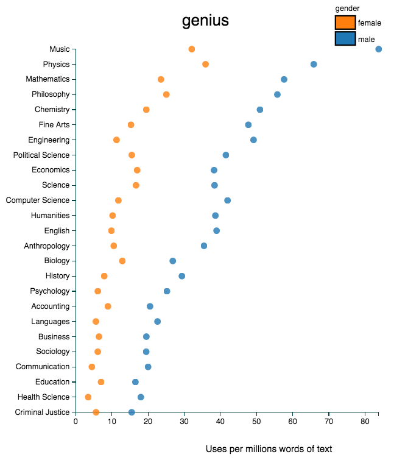

Want to use interactive graphics to help amplify your research? This post talks about how to do that, using [my new international research](http://d-miller.github.io/assets/MillerEaglyLinn2015.pdf) as an example. Most recently, [_Science_](http://news.sciencemag.org/social-sciences/2015/05/science-still-seen-male-profession-according-international-study-gender-bias) mentioned the interactive table I created for that study.

## Three examples of interactive graphics in the news

This post aims to reach both people looking to learn more about (a) interactive graphics and (b) gender bias in science. I discuss three examples here, and then later talk about how I made the table for [my new international study](http://d-miller.github.io/assets/MillerEaglyLinn2015.pdf) [click here to jump to the table]. 

### Example #1: Interactive table [D3.js]

My latest research finds that stereotypes associating science with men prevail worldwide, even in supposedly “gender-equal” nations like Denmark and Norway ([PDF](http://d-miller.github.io/assets/MillerEaglyLinn2015.pdf); [press release](http://www.northwestern.edu/newscenter/stories/2015/05/gender-science-stereotypes-persist-across-the-world.html)). I created an interactive table using the [JavaScript library D3.js](http://d3js.org/) to show what nations have the strongest stereotypes. 

[[RELATED POST: 5 Reasons to Learn D3.js]](http://d-miller.github.io/Why-Learn-D3/)

You might be surprised to learn what nation had the strongest stereotypes out of all 66 nations studied! [jump to table]

I love that the table is so simple (just one interactive control!), yet directly influenced news coverage in [_Pacific Standard_](http://www.psmag.com/health-and-behavior/when-it-comes-to-female-scientists-seeing-is-believing), [_Science_](http://news.sciencemag.org/social-sciences/2015/05/science-still-seen-male-profession-according-international-study-gender-bias), [_U.S. News_](http://www.usnews.com/news/blogs/data-mine/2015/05/18/stem-gender-stereotypes-common-across-the-world), and [_Yahoo News_](http://news.yahoo.com/gender-science-stereotype-strongest-holland-082246004.html). This example demonstrates an important point: simple graphics can sometimes present information more effectively than graphics with many distracting bells and whistles.  

In this case, the table helped provide reporters with information about international rankings and statistics. Those reporters did not directly contact me about such details. In fact, only one of those outlets interviewed me on the phone, but we didn’t talk about the detailed rankings that appeared in the [final news piece](http://news.sciencemag.org/social-sciences/2015/05/science-still-seen-male-profession-according-international-study-gender-bias).

So how did the reporters know about my website? [Northwestern University’s press release](http://www.northwestern.edu/newscenter/stories/2015/05/gender-science-stereotypes-persist-across-the-world.html) mentioned it. So here's a tip: if you’ve made awesome graphics for your research, work with your university’s or company’s public relations office to promote it.

Such graphics might also increase the chances that reporters will cover your study. And if reporters do cover your study, those graphics can help provide critical information, as my example demonstrates. 

Don’t expect reporters to always directly contact you about your study, especially because the news world can be quite fast paced. Reporters might not have the time to contact you. [_U.S. News_](http://www.usnews.com/news/blogs/data-mine/2015/05/18/stem-gender-stereotypes-common-across-the-world), for instance, covered my study three hours after the press release came out (and yes, the reporter wrote the coverage in just those three hours). 

Hence, include critical information about your study in the press release and, if appropriate, provide links to informative interactive graphics. And keep in mind that simple graphics can be quite effective. 

### Example #2: Interactive graphs [D3.js] 

Benjamin Schmidt at Northeastern University made [this interactive graphic](http://benschmidt.org/profGender/) about gendered language in teacher reviews. The graphic, also created using D3.js, received extensive attention both through [social media](https://twitter.com/benmschmidt/status/563754577359814656) and major outlets such as [_New York Times_](http://www.nytimes.com/2015/02/07/upshot/is-the-professor-bossy-or-brilliant-much-depends-on-gender.html).

Here’s an example screenshot relating to [recent research](http://www.sciencemag.org/content/347/6219/262) about gender stereotypes that imbue men, not women, with intellectual “genius.” 

[[RELATED RESEARCH: Describing Applicants in Gendered Language Might Influence Academic Science Hiring]](http://www.americanscientist.org/blog/pub/gendered-language-science-hiring)

Here's some example Tweets.

<blockquote class="twitter-tweet" lang="en">
How do student evaluations describe men and women differently? Test your theories here: <a href="http://t.co/yLLOcpXZ7u">http://t.co/yLLOcpXZ7u</a> <a href="http://t.co/v6OlkjiosU">pic.twitter.com/v6OlkjiosU</a>
&mdash; Benjamin Schmidt (@benmschmidt) <a href="https://twitter.com/benmschmidt/status/563754577359814656">February 6, 2015</a></blockquote>

This example demonstrates the power of social media. In an email to me, Schmidt shared the backstory behind this visualization: it caused a stir on Twitter when he first shared it there, a New York Times reporter contacted him a few hours later, and then other media outlets started to pick up the story too. Major outlets therefore helped highlight the website, but it all started with [a well-crafted Tweet](https://twitter.com/benmschmidt/status/563754577359814656).

So how did the reporters know about my website? [Northwestern University’s press release](http://www.northwestern.edu/newscenter/stories/2015/05/gender-science-stereotypes-persist-across-the-world.html) mentioned it. So here's a tip: if you’ve made awesome graphics for your research, work with your university’s or company’s public relations office to promote it.

The example Tweets, in part, show why 

<link rel="stylesheet" href="../assets/test/styles/styles.css">

  

    <h1><strong>Global Gender-Science Stereotypes</strong></h1>
    <h3>(Click header labels to resort)</h3>
  

  

  

